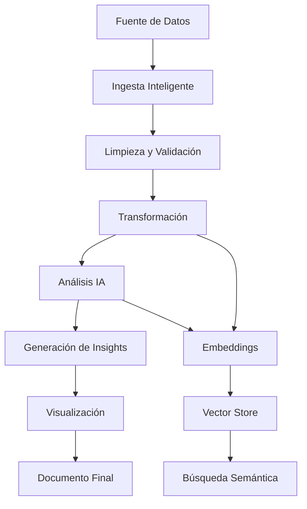

# 🚀 AutoData MCP - Plan de Mejoras y Nuevas Funcionalidades

## 📋 Descripción General
AutoData es un servidor MCP (Model Context Protocol) diseñado para análisis integral de datos. Este documento describe las mejoras necesarias y nuevas funcionalidades para convertirlo en la herramienta definitiva de análisis de datos.

## 🎯 Objetivos Principales
- **Análisis Universal**: Capacidad de procesar cualquier tipo de dato (APIs, bases de datos, archivos, streams)
- **Inteligencia Contextual**: Comprensión profunda de patrones y relaciones en los datos
- **Generación Avanzada**: Creación de documentos profesionales (DOCX, PDF) con análisis y visualizaciones
- **Transformación Inteligente**: Conversión automática a embeddings para búsquedas semánticas

## 📊 Estado Actual - Funcionalidades Existentes

### ✅ Bases de Datos Soportadas
- **MySQL**: Análisis, consultas, búsquedas y embeddings
- **MongoDB**: Operaciones completas con agregaciones
- **PostgreSQL**: Soporte completo incluyendo búsqueda por similitud

### ✅ Herramientas de Análisis
- Transformación de APIs a DataFrames
- Análisis estadístico descriptivo
- Generación de reportes HTML/Markdown
- Búsqueda web con Serper
- Carga segura de URLs

### ✅ Funcionalidades de Datos
- Subida de DataFrames a bases de datos
- Generación automática de embeddings
- Análisis de patrones y insights

## 🔧 Mejoras Requeridas para Funcionalidades Existentes

### 🎨 Sistema de Reportes
- [ ] **Exportación a PDF**: Integrar bibliotecas como Puppeteer o jsPDF
- [ ] **Exportación a DOCX**: Usar bibliotecas como docx o officegen
- [ ] **Gráficos Avanzados**: Más tipos de visualizaciones (scatter, bubble, heatmaps)
- [ ] **Temas Personalizables**: Paletas de colores corporativas
- [ ] **Plantillas Profesionales**: Templates predefinidos para diferentes industrias

### 📊 Análisis de Datos
- [ ] **Análisis Predictivo**: Integrar modelos de ML básicos
- [ ] **Detección de Anomalías**: Identificación automática de outliers
- [ ] **Correlaciones Avanzadas**: Matrices de correlación y análisis multivariable
- [ ] **Series Temporales**: Análisis de tendencias y estacionalidad
- [ ] **Clustering**: Agrupación automática de datos similares

### 🗄️ Mejoras de Base de Datos
- [ ] **Pool de Conexiones**: Optimización para múltiples consultas concurrentes
- [ ] **Transacciones**: Soporte completo para operaciones ACID
- [ ] **Migraciones**: Herramientas para transferencia entre diferentes SGBD
- [ ] **Backup/Restore**: Funcionalidades de respaldo automatizado
- [ ] **Índices Inteligentes**: Sugerencias automáticas de optimización

## 🆕 Nuevas Funcionalidades Requeridas

### 📁 Soporte de Archivos Extendido
- [ ] **CSV Avanzado**: Detección automática de delimitadores y encoding
- [ ] **Excel Completo**: Múltiples hojas, fórmulas, formatos
- [ ] **JSON Complejo**: Anidamiento profundo, arrays multidimensionales
- [ ] **XML/HTML**: Extracción inteligente de datos estructurados
- [ ] **Parquet**: Soporte para formato columnar
- [ ] **Avro**: Schemas evolutivos
- [ ] **ORC**: Optimización para analytics

### 🌐 APIs y Servicios Web
- [ ] **GraphQL**: Consultas y mutaciones complejas
- [ ] **REST Avanzado**: Paginación automática, rate limiting
- [ ] **WebSockets**: Datos en tiempo real
- [ ] **Autenticación**: OAuth2, JWT, API Keys
- [ ] **Scraping Inteligente**: Extracción de datos de sitios web
- [ ] **FTP/SFTP**: Acceso a servidores de archivos

### 🧠 Inteligencia Artificial
- [ ] **NLP Avanzado**: Análisis de sentimientos, entidades, temas
- [ ] **Clasificación Automática**: Categorización de datos textuales
- [ ] **Resumen Inteligente**: Generación automática de insights
- [ ] **Predicciones**: Modelos de forecasting integrados
- [ ] **Recomendaciones**: Sistema de sugerencias basado en patrones

### 🔍 Búsqueda y Embeddings
- [ ] **Vector Databases**: Integración con Pinecone, Weaviate, Qdrant
- [ ] **Múltiples Modelos**: Soporte para diferentes modelos de embeddings
- [ ] **Búsqueda Híbrida**: Combinación de búsqueda exacta y semántica
- [ ] **RAG (Retrieval Augmented Generation)**: Generación contextual
- [ ] **Fine-tuning**: Personalización de modelos para dominios específicos

### 📊 Visualización Avanzada
- [ ] **Dashboard Interactivo**: Paneles en tiempo real
- [ ] **Mapas**: Visualizaciones geoespaciales
- [ ] **Redes**: Grafos y análisis de conexiones
- [ ] **3D**: Visualizaciones tridimensionales
- [ ] **Animaciones**: Gráficos temporales animados

### 🔄 Procesamiento en Tiempo Real
- [ ] **Streaming**: Apache Kafka, RabbitMQ
- [ ] **ETL Pipelines**: Orquestación de flujos de datos
- [ ] **Monitoring**: Alertas y notificaciones automáticas
- [ ] **Escalabilidad**: Procesamiento distribuido

### 🛡️ Seguridad y Governance
- [ ] **Encriptación**: Datos en tránsito y en reposo
- [ ] **Auditoría**: Logs completos de operaciones
- [ ] **Control de Acceso**: RBAC (Role-Based Access Control)
- [ ] **Compliance**: GDPR, HIPAA, SOX
- [ ] **Data Lineage**: Trazabilidad completa de datos

## 🎯 Casos de Uso Objetivo

### 📈 Análisis Financiero
- Procesamiento de datos de mercados financieros
- Análisis de riesgo y compliance
- Generación de reportes regulatorios

### 🏥 Análisis de Salud
- Procesamiento de datos clínicos
- Análisis epidemiológico
- Reportes médicos automatizados

### 🛒 E-commerce
- Análisis de comportamiento de usuarios
- Recomendaciones personalizadas
- Optimización de inventario

### 🏭 IoT e Industria 4.0
- Análisis de sensores en tiempo real
- Mantenimiento predictivo
- Optimización de procesos

## 🎨 Generación de Documentos Profesionales

### 📄 Formatos Objetivo
- **PDF**: Reportes ejecutivos, presentaciones
- **DOCX**: Documentos colaborativos, informes detallados
- **PPTX**: Presentaciones automáticas
- **HTML**: Dashboards web, reportes interactivos

### 🎨 Características Avanzadas
- **Plantillas Corporativas**: Branding automático
- **Gráficos Integrados**: Visualizaciones nativas en documentos
- **Tablas Dinámicas**: Datos actualizables
- **Índices Automáticos**: Navegación inteligente
- **Comentarios**: Anotaciones contextuales

## 🔄 Pipeline de Procesamiento Ideal

## 📋 Prioridades de Desarrollo

### 🥇 Fase 1 (Crítica)
1. Exportación a PDF/DOCX
2. Soporte completo de CSV/Excel
3. Mejoras en análisis estadístico
4. Optimización de embeddings

### 🥈 Fase 2 (Alta)
1. APIs GraphQL y autenticación
2. Visualizaciones avanzadas
3. Procesamiento en tiempo real básico
4. Vector databases

### 🥉 Fase 3 (Media)
1. Machine Learning integrado
2. Dashboards interactivos
3. Escalabilidad distribuida
4. Compliance y seguridad avanzada

## 🎯 Métricas de Éxito
- **Velocidad**: Procesamiento de 1M+ registros en <30 segundos
- **Precisión**: >95% accuracy en detección de patrones
- **Usabilidad**: Generación de reportes en <5 minutos
- **Escalabilidad**: Soporte para 100+ usuarios concurrentes
- **Compatibilidad**: 20+ formatos de datos soportados

## 🚀 Conclusión
AutoData debe evolucionar hacia una plataforma integral que no solo analice datos, sino que genere inteligencia accionable de manera automática, creando documentos profesionales que faciliten la toma de decisiones estratégicas.