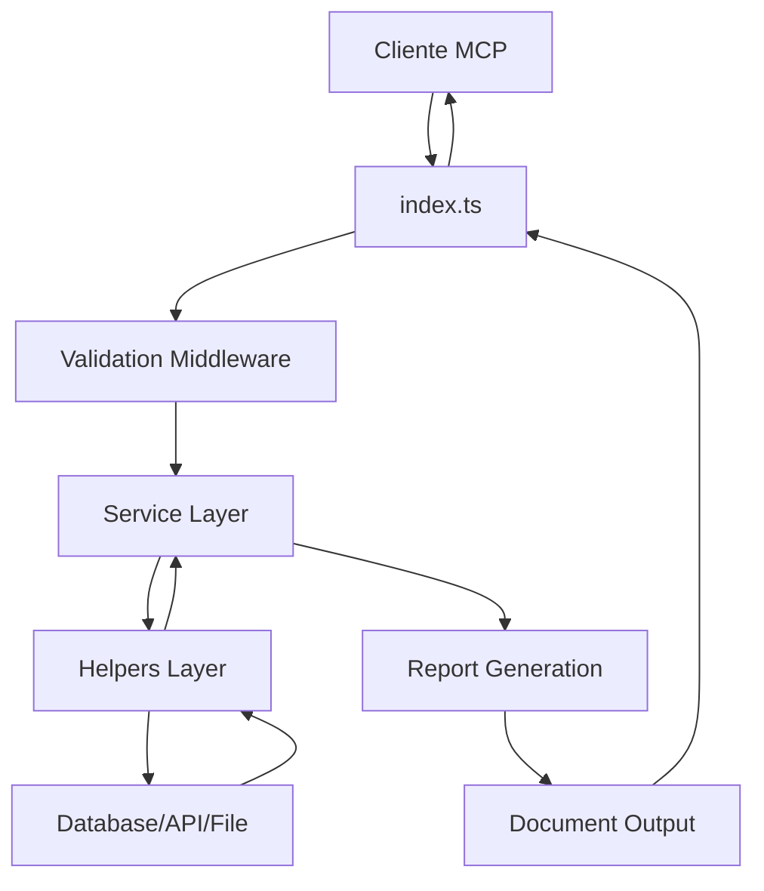

# 🏗️ AutoData MCP - Arquitectura y Estructura del Proyecto

## 📁 Estructura Actual del Proyecto

```
mcp/
├── package.json                 # Configuración del proyecto y dependencias
├── tsconfig.json               # Configuración de TypeScript
├── README-FEATURES.md          # Plan de mejoras y nuevas funcionalidades
├── README-STRUCTURE.md         # Este archivo - Arquitectura del proyecto
├── README-GUIDELINES.md        # Reglas y buenas prácticas
├── .env.example               # Variables de entorno de ejemplo
├── .gitignore                 # Archivos a ignorar por Git
├── .eslintrc.json            # Configuración de ESLint
├── .prettierrc               # Configuración de Prettier
├── build/                    # Código JavaScript compilado
│   ├── index.js
│   └── helpers/
│       ├── database.js
│       ├── dataframes.js
│       ├── fetchs.js
│       ├── mongodb.js
│       ├── mysql.js
│       ├── postgresql.js
│       ├── reports.js
│       └── simple-dataframes.js
├── src/                      # Código fuente TypeScript
│   ├── index.ts             # Servidor MCP principal
│   ├── types/               # Definiciones de tipos TypeScript
│   │   ├── database.ts
│   │   ├── reports.ts
│   │   ├── api.ts
│   │   └── common.ts
│   ├── helpers/             # Módulos auxiliares
│   │   ├── fetchs.ts       # Funciones de HTTP y APIs
│   │   ├── mongodb.ts      # Operaciones MongoDB
│   │   ├── mysql.ts        # Operaciones MySQL
│   │   ├── postgresql.ts   # Operaciones PostgreSQL
│   │   ├── reports.ts      # Generación de reportes
│   │   ├── dataframes.ts   # Análisis de DataFrames
│   │   ├── embeddings.ts   # Gestión de embeddings
│   │   ├── files.ts        # Procesamiento de archivos
│   │   ├── validation.ts   # Validación de datos
│   │   └── utils.ts        # Utilidades generales
│   ├── services/            # Servicios de negocio
│   │   ├── AnalysisService.ts
│   │   ├── ReportService.ts
│   │   ├── DatabaseService.ts
│   │   ├── EmbeddingService.ts
│   │   └── FileService.ts
│   ├── middleware/          # Middleware para validación y seguridad
│   │   ├── validation.ts
│   │   ├── security.ts
│   │   ├── logging.ts
│   │   └── errorHandler.ts
│   ├── config/              # Configuraciones
│   │   ├── database.ts
│   │   ├── server.ts
│   │   └── constants.ts
│   └── templates/           # Plantillas para reportes
│       ├── html/
│       │   ├── basic.hbs
│       │   ├── executive.hbs
│       │   └── technical.hbs
│       ├── markdown/
│       │   ├── basic.md
│       │   └── detailed.md
│       └── assets/
│           ├── css/
│           ├── js/
│           └── images/
├── tests/                   # Pruebas automatizadas
│   ├── unit/
│   │   ├── helpers/
│   │   ├── services/
│   │   └── middleware/
│   ├── integration/
│   │   ├── database/
│   │   ├── api/
│   │   └── reports/
│   └── fixtures/           # Datos de prueba
│       ├── sample-data/
│       └── mock-apis/
├── docs/                   # Documentación
│   ├── api/               # Documentación de API
│   ├── guides/            # Guías de uso
│   ├── examples/          # Ejemplos de código
│   └── architecture/      # Documentación técnica
└── scripts/               # Scripts de automatización
    ├── build.sh
    ├── test.sh
    ├── deploy.sh
    └── setup-dev.sh
```

## 🧩 Arquitectura por Capas

### 🎯 Capa de Presentación (MCP Server)
- **index.ts**: Servidor principal MCP que define todas las herramientas
- **Responsabilidad**: Interfaz entre el protocolo MCP y la lógica de negocio
- **Funciones**: Registro de herramientas, validación de entrada, formateo de respuestas

### 🏢 Capa de Servicios (Business Logic)
```typescript
services/
├── AnalysisService.ts      # Análisis estadístico y predictivo
├── ReportService.ts        # Generación de documentos
├── DatabaseService.ts      # Operaciones de bases de datos
├── EmbeddingService.ts     # Gestión de embeddings y vectores
└── FileService.ts          # Procesamiento de archivos
```

### 🔧 Capa de Helpers (Utilities)
```typescript
helpers/
├── fetchs.ts              # HTTP requests y APIs
├── databases/
│   ├── mongodb.ts         # Operaciones MongoDB específicas
│   ├── mysql.ts           # Operaciones MySQL específicas
│   └── postgresql.ts      # Operaciones PostgreSQL específicas
├── analysis/
│   ├── dataframes.ts      # Manipulación de datos
│   ├── statistics.ts      # Cálculos estadísticos
│   └── ml.ts              # Machine Learning básico
├── formats/
│   ├── csv.ts             # Procesamiento CSV
│   ├── excel.ts           # Procesamiento Excel
│   ├── json.ts            # Procesamiento JSON
│   └── xml.ts             # Procesamiento XML
└── outputs/
    ├── pdf.ts             # Generación PDF
    ├── docx.ts            # Generación DOCX
    └── charts.ts          # Generación de gráficos
```

### 🛡️ Capa de Middleware
```typescript
middleware/
├── validation.ts          # Validación de esquemas Zod
├── security.ts            # Sanitización y seguridad
├── logging.ts             # Logs estructurados
├── errorHandler.ts        # Manejo centralizado de errores
├── rateLimit.ts           # Limitación de requests
└── auth.ts                # Autenticación y autorización
```

### 🗄️ Capa de Datos (Data Access)
- **Abstracciones**: Interfaces comunes para diferentes bases de datos
- **Patrones**: Repository pattern para operaciones CRUD
- **Optimización**: Connection pooling y cache

## 🔄 Nuevos Servicios Sugeridos

### 📊 AdvancedAnalyticsService
```typescript
class AdvancedAnalyticsService {
  // Análisis predictivo
  async performPredictiveAnalysis(data: DataFrame): Promise<PredictionResult>
  
  // Detección de anomalías
  async detectAnomalies(data: DataFrame): Promise<AnomalyReport>
  
  // Clustering automático
  async performClustering(data: DataFrame): Promise<ClusterResult>
  
  // Análisis de series temporales
  async analyzeTimeSeries(data: DataFrame): Promise<TimeSeriesAnalysis>
}
```

### 🤖 AIService
```typescript
class AIService {
  // Análisis de sentimientos
  async analyzeSentiment(text: string[]): Promise<SentimentResult>
  
  // Extracción de entidades
  async extractEntities(text: string): Promise<EntityResult>
  
  // Clasificación de texto
  async classifyText(text: string[]): Promise<ClassificationResult>
  
  // Generación de resúmenes
  async generateSummary(data: any[]): Promise<SummaryResult>
}
```

### 📄 DocumentGenerationService
```typescript
class DocumentGenerationService {
  // Generación de PDF
  async generatePDF(template: Template, data: any): Promise<Buffer>
  
  // Generación de DOCX
  async generateDOCX(template: Template, data: any): Promise<Buffer>
  
  // Generación de PPTX
  async generatePPTX(slides: SlideTemplate[], data: any): Promise<Buffer>
  
  // Plantillas dinámicas
  async createTemplate(type: 'executive' | 'technical' | 'summary'): Promise<Template>
}
```

### 🔍 SearchService
```typescript
class SearchService {
  // Búsqueda semántica
  async semanticSearch(query: string, collection: string): Promise<SearchResult>
  
  // Búsqueda híbrida
  async hybridSearch(query: string, filters: any): Promise<SearchResult>
  
  // Indexación automática
  async createIndex(data: any[], fields: string[]): Promise<IndexResult>
  
  // Similitud de documentos
  async findSimilar(document: any, threshold: number): Promise<SimilarityResult>
}
```

### 🌐 IntegrationService
```typescript
class IntegrationService {
  // Conectores de APIs
  async connectAPI(config: APIConfig): Promise<APIConnector>
  
  // Conectores de archivos
  async connectFile(path: string, type: FileType): Promise<FileConnector>
  
  // Conectores de streaming
  async connectStream(config: StreamConfig): Promise<StreamConnector>
  
  // Pipelines ETL
  async createPipeline(steps: ETLStep[]): Promise<Pipeline>
}
```

### 📈 VisualizationService
```typescript
class VisualizationService {
  // Gráficos estáticos
  async createChart(type: ChartType, data: any[], config: ChartConfig): Promise<ChartResult>
  
  // Dashboards interactivos
  async createDashboard(widgets: Widget[]): Promise<Dashboard>
  
  // Mapas y geolocalización
  async createMap(data: GeoData[], config: MapConfig): Promise<MapResult>
  
  // Gráficos 3D
  async create3DVisualization(data: any[], config: 3DConfig): Promise<3DResult>
}
```

## 🗂️ Estructura de Datos

### 📊 Modelos de Datos
```typescript
models/
├── DataFrame.ts           # Estructura principal de datos
├── Report.ts              # Modelo de reportes
├── Analysis.ts            # Resultados de análisis
├── Chart.ts               # Configuración de gráficos
├── Database.ts            # Configuración de conexiones
└── User.ts                # Gestión de usuarios
```

### 🔄 Interfaces
```typescript
interfaces/
├── IAnalysisProvider.ts   # Proveedores de análisis
├── IDatabaseProvider.ts   # Proveedores de BD
├── IReportGenerator.ts    # Generadores de reportes
├── IFileProcessor.ts      # Procesadores de archivos
└── IEmbeddingProvider.ts  # Proveedores de embeddings
```

## 🔧 Configuración y Setup

### 📦 package.json Mejorado
```json
{
  "scripts": {
    "dev": "tsx watch src/index.ts",
    "build": "tsc && npm run lint",
    "test": "vitest",
    "test:coverage": "vitest --coverage",
    "lint": "eslint src/**/*.ts",
    "lint:fix": "eslint src/**/*.ts --fix",
    "format": "prettier --write src/**/*.ts",
    "type-check": "tsc --noEmit",
    "clean": "rimraf build dist",
    "setup": "./scripts/setup-dev.sh"
  }
}
```

### 🔧 Nuevas Dependencias Sugeridas
```json
{
  "dependencies": {
    "puppeteer": "^21.0.0",
    "officegen": "^0.6.5",
    "docx": "^8.0.0",
    "chart.js": "^4.0.0",
    "d3": "^7.8.0",
    "sharp": "^0.32.0",
    "pdf-lib": "^1.17.0",
    "compromise": "^14.0.0",
    "natural": "^6.0.0",
    "ml-matrix": "^6.10.0",
    "apache-arrow": "^13.0.0",
    "parquetjs": "^0.11.0"
  },
  "devDependencies": {
    "vitest": "^0.34.0",
    "@vitest/coverage-c8": "^0.33.0",
    "tsx": "^3.14.0",
    "rimraf": "^5.0.0"
  }
}
```

## 🐳 Containerización

### 📄 Dockerfile
```dockerfile
FROM node:18-alpine
WORKDIR /app
COPY package*.json ./
RUN npm ci --only=production
COPY build/ ./build/
EXPOSE 3000
CMD ["node", "build/index.js"]
```

### 🐙 docker-compose.yml
```yaml
version: '3.8'
services:
  autodata:
    build: .
    ports:
      - "3000:3000"
    environment:
      - NODE_ENV=production
    depends_on:
      - postgres
      - mongodb
      - ollama
  
  postgres:
    image: pgvector/pgvector:pg15
    environment:
      POSTGRES_DB: autodata
      POSTGRES_USER: admin
      POSTGRES_PASSWORD: secret
  
  mongodb:
    image: mongo:7
    environment:
      MONGO_INITDB_ROOT_USERNAME: admin
      MONGO_INITDB_ROOT_PASSWORD: secret
  
  ollama:
    image: ollama/ollama
    volumes:
      - ollama_data:/root/.ollama
```

## 🔄 Flujo de Datos



## 📋 Checklist de Implementación

### ✅ Estructura Base
- [x] Configuración TypeScript
- [x] Helpers de bases de datos
- [x] Generación básica de reportes
- [ ] Sistema de tipos completo
- [ ] Middleware de validación
- [ ] Servicios de negocio

### 🔄 Próximos Pasos
1. **Refactorización**: Migrar helpers a servicios
2. **Tipos**: Definir interfaces y modelos
3. **Middleware**: Implementar validación y seguridad
4. **Testing**: Crear suite de pruebas
5. **Documentación**: API docs y guías

## 🚀 Escalabilidad

### 🔧 Optimizaciones Futuras
- **Microservicios**: Dividir en servicios especializados
- **Cache**: Redis para datos frecuentes
- **Queue**: Bull/Agenda para trabajos pesados
- **Monitoring**: Prometheus + Grafana
- **Load Balancing**: NGINX para múltiples instancias

### 📊 Métricas de Arquitectura
- **Modularidad**: >90% funciones reutilizables
- **Testabilidad**: >95% cobertura de código
- **Mantenibilidad**: <500 líneas por archivo
- **Performance**: <200ms tiempo de respuesta promedio